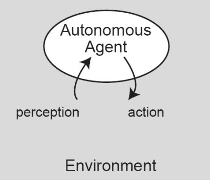
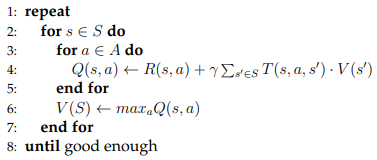
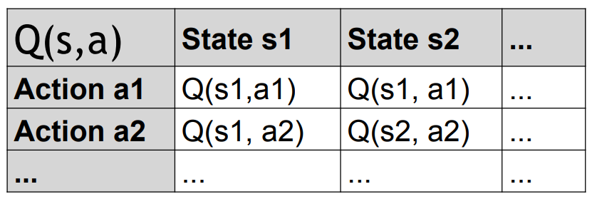

# Exercise 2: A Reactive Agent for the Pickup and Delivery Problem


| Exercise       | Company   | Vehicles | Tasks | Planner |
| -------------- |:---------:|:--------:|:-----:|:-------:|
| Reactive agent | 1 company | N reactive agents move thorugh topology, sensing tasks | Spread out in the topology | Reactive planner: sensing function of tasks; selects actions on the basis of a learned state-action table |

## Documentation
Overleaf link [here](https://www.overleaf.com/1615262219smrybvqdjzrs).

## A **Reactive Agent** for the Pickup and Delivery Problem
In this exercise, we will learn to use a reactive agent to solve the **Pickup and Delivery Problem**. For that, we will implement a _reinforcement learning algorithm (RLA)_ to compute an optimal strategy off-line. This strategy is then used by the agent to travel through the network.


### What is Pickup and Delivery Problem (PDP)?
- Constrained (multiple) travelling Salesman Problem
- Logistic company with a fleet of trucks
- **Goals**:
    - satisfy the customer requests: loads have to be transported from their origin location to their delivery point
    - optimize profit
- **Constraints**:
    - the cost of the vehicles and crews
    - the fuel capacities
    - etc.
- Real problem: companies are applying agent technology to Logistics

<center>

| Classical Approach      | Agent Systems             | 
| ----------------------- |:-------------------------:|
| Large hierarchical apps | Societies od Small Agents | 
| Batch                   | Real-time                 |
| Sequential Processing   | Concurrent                |
| Follow instructions     | Negotiations on-the-fly   |
| Static                  | Dynamic                   |

</center>

- **Environment**:
    - Topology of Cities: city (node), road (edge)
    - Coordinates and distances
    - Not dynamic

- **Customer requests**:
    - Tasks are spread over the topology

- **Transportation tasks**:
    - Pickup city
    - Delivery city
    - Weight in KG
    - Reward in CHF

- **Logistic companies (1+)**:
    - Owns 1+ trucks
    - Fulfill customer requests

- **Lifecycle**:
    - Working without interruption until all tasks are delivered
    - Exception: reactive agent will travel all the time

- **Vehicles**:
    - Fixed load capacity
    - 1+ tasks at a time
    - Starting place
    - Obliged to deliver a task to its destination
    - Cost for a specific task: `function(route)`

- **Planners/Behaviors**:
    - **Brain** of the intelligent agent
    - decide what to do at every time step

### What is LogistPlatform?
- A simulation platform for the PDP
- Implements the PDP as presented
- Built on RePast:
    - Discrete scheduler
    - Dynamic visualization
- Version: 1.0
- 3 configuration files:
    - `topology.xml` - specifies the routes
    - `reactive.xml` - specifies the framework setup, e.g. the classpath to behaviors, number of agents and their parameters
    - `tasks.xml` - specifies the probabilities/tasks
- Helps implement custom agent behaviors:
    - Act upon signals and generate appropriate responses
    - Interface with the platform in order to create more sophisticated behaviors (e.g. auction)

### What is Reactive Agent?
- Simple behaviors that react to the stimuli (e.g. stimuli from sensor on the robot) from the environment.





### Reactive Agent Architecture?
- Vehicles as **reactive agents**
- **Percepts** from the environment (state):
    - route?
    - city?
    - task?
- **Actions** the agent can take:
    - move in a direction according to the topology
    - pickup a task
    - deliver a task
- 3 steps:
    1. Learn offline the actions to take (**strategy**) in order to optimally search and deliver tasks (using _reinforcement learning algorithm (RLA)_ - **Markov Decission Processes (MDP**))
    2. Using the learned strategy, **travel** through the network
    3. When a task has been **picked up**, **deliver** it on the shortest path (given in platform implementation)


### Assumptions
We make the following assumption about the reactive agent :
1. The vehicle starts from its home city and can move freely through the network.
2. When the vehicle arrives in a city, it finds out whether or not a task is available in that city. The vehicle sees at most 1 task!
3. If a task is available, the agent can decide to: 
    - pick up the task and deliver it, or it can 
    - refuse the task and move to another city (without load)
4. If no task is available or if the task was refused, the vehicle moves along a route to a neighboring city.
5. The vehicle can transport only 1 task at a time.
6. The agent receives a reward for each task that it delivers and pays a cost for each kilometer that it travels. Since the agent tries to maximize its profit, it will always deliver a task on the shortest path. Must deliver it, and on the shortest path (given by the platform).
7. A task which was refused disappears immediately. The next time the agent moves to that city a new task is generated according to the probability distribution. So, there exists a probability distribution of the tasks.

---
# Implementation

## Applyting reinforcement learning (Markov Decision Processes) to learn an optimal strategy
An intelligent reactive agent can improve its performance by learning to optimally respond to the percepts received. Using reinforcement learning the agent can learn to react optimally on the basis of a **probability distribution** of the tasks in the network. This approach assumes that the probability distribution is _known_. The learning phase is done offline before the agent travels through the network.

The following steps should therefore be taken :
1. On the basis of a probability distribution of the tasks, **learn** offline the actions to take in order to handle tasks optimally. MDP Solver: offline, before agent travels! So, learn **optimal strategy** (i.e. make a table) to move in the network and deliver tasks.
2. Use the created table (the strategy) to travel through the network and to quickly fetch the best response to a given state of the world.
3. As soon as a task has been picked up, deliver it on the shortest path to the destination city. (This is already implemented by the platform.)

At the beginning there are two tables:
- `p(i, j)`: The probability that in city `i` there is a task to be transported to city `j`.
- `r(i, j)`: The (average) reward for a task that is transported from city `i` to city `j`.

### Timeline:
- **Beforehand**: These tables are created from the task set settings in the configuration file and can be accessed through the `TaskDistribution` object that is given during setup. So, tasks `t_ij` have been created with the probability `p_ij` and a variation reward around `r_ij`.
- **At runtime**: Task from the current city `i` to some other city `j` will be created with probability `p(i, j)` and will have a reward of `r(i, j)`.


## Implementing the Reinforcement Learning Algorithm (RLA)
In this exercise, we must implement the offline reinforcement learning algorithm. The first thing that we need to do (and this is the most difficult part of this exercise) is to define (on paper !) :
- An adequate **state** representation of the world
- Which **actions** we can take in each state, and 
    - the corresponding **state transition**,
    - the **probability of the transition** and
    - the **reward of the transition**.

Remember that a reactive agent chooses an action depending **only** on its perceived state of the world. So, be very careful and test an representation on paper before we start programming !

Furthermore, we need to define:
- `Best(S)`: vector indicating the best action from a state 
- `V(S)`: the corresponding accumulated value; we must learn `V(S)` by value iteration:



### Data Structures
- `V(S)`: vector indicating the discounted sum of the rewards to be earned (on expectation) by following that solution from state `s`.
- `R(s, a)`: table that indicates the rewards for taking action `a` being in state `s`.
- `T(s, a, s0)`: table which defines the probability to arrive in state `s0` given that we are in state `s` and that we take action `a`, i.e. `T(s, a, s0) = Pr{s0|s, a}`.
- `γ`: discount factor that ensures the algorithm converges; it must be between 0 and 1, preferably close to 1.



At each iteration, update `Q(s, a)` and `V(S)`. The algorithm stops whenever there is no more a change in `V(S)`. When we have learned `V(S)`, the agent can start to move through the topology following the actions indicated in `V(S)`.


## Task
- [ ] Define:
    - state representation `s`
    - possible actions `a`
    - reward table `R(s, a)` 
    - probability transition table `T(s, a, s0)` - this is the hardest and most crucial part of the exercise.
- [ ] Implement the offline reinforcement learning algorithm for determining the actions to take in order to search and deliver tasks optimally. This algorithm should be executed before the vehicles start moving.
- [ ] Run simulations of one, two and three agents using an optimally learned strategy `V(S)`. Look at the performance graph of the agents. How does it change for different discount factors? Explain an results. Test limit cases.

## Hints
There is a seperate document that elaborates the relevant parts of the LogistPlatform for this exercise.
- Do note that there is a continuous supply of tasks and that the simulation will run forever. Use the exit button from the Repast UI to shutdown the platform cleanly.
- The prepared package comes with various configuration files that allow we to test the solution. Feel free to change them and see how it affects the program. When we hand-in the solution please make sure that we correctly set the discount factor and any other user-defined values (if we use them).
- The task distribution can be given a seed in order to make the task generation deterministic. This is invaluable when doing code debugging, but please test the program with other seeds, too. If the program has just crashed look at the `history.xml` file - it contains a detailed history of events. If we reuse the seed values provided there (by changing the configuration file) we should be able to repeat the crash.
- The graph that we see when running the logist platform gives the reward per kilometer after each action and this is **NOT** a function that we need to optimize, RLA optimizes another function.

## Run Simulation
For 1 agent (called reactive-random):

```
java -jar lib/logist.jar config/reactive.xml reactive-random
```

For 3 agents (all called the same, reactive-random):
```
java -jar lib/logist.jar config/reactive.xml reactive-random reactive-random reactive-random
```

Our implementation (with the configuration that is currently in the repo):
```
ava -jar lib/logist.jar config/reactive.xml reactive-rla-99 reactive-rla-95 reactive-rla reactive-rla-50 reactive-rla-15 reactive-random
```


Note: the inicial parameters can affect the results. Also, there can be a better implementation which gives a bigger difference between the performace of a true reactive agent and random one.

---
# Submission

## Instructions
1.  Download the skeleton files for the reactive exercise
2.  Import the project in Eclipse (or another IDE, for example Netbeans).
3.  Reference the library logist and the other libraries that we downloaded from the moodle page for this exercise
4.  Link the javadoc for the logist library
5.  Read carefully the documentation for logist - there we can find instructions how to execute the platform
6.  Write an agent
7.  The name of the agent (in agents.xml) that represents an final solution should be reactive-rla
8.  Make sure that we fulfill the requirements for the solution given in the exercise description
9.  Perform some simulations and analyze the performance of an reactive agent according to the instructions given in the latex template for the report
10.	Create a folder named &quot;doc&quot; in the project
11. Write documentation using the latex template and place it into a doc folder that we created. The pdf should be named lastname1-lastname2-ex2.pdf. The report should not be longer than 3 pages.
12.	Zip the folder lastname1-lastname2-ex2 (without the libraries) and submit it on moodle

## Deliverables (Due on Tuesday 08.10.2019, 23:55) :
- A report in PDF describing an state representation, where code and the results obtained with an solution.
_The report should be based on a latex template that is given on the exercise description moodle page._
- the name of an agent (in `agents.xml`) that represents an final solution should be `reactive-rla`
- rename the reactive folder to _lastname1-lastname2-ex2_
- create a directory called doc within this folder and place the report in this folder
- create a zipfile _lastname1-lastname2-ex2.zip_ containing everything in the _lastname1-lastname2-ex2_ folder.


