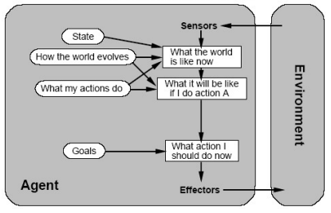

# Exercise 3: Implementing a deliberative Agent

| Exercise       | Company   | Vehicles | Tasks | Planner |
| -------------- |:---------:|:--------:|:-----:|:-------:|
| Deliberative agent | 1 company | 1 Deliberative agent. Implements an optimal plan with state-based search algorithm. | Spread out in the topology | Deliberative planner: models all possible states; returns optimal plan |

## Documentation
Overleaf link [here](https://www.overleaf.com/9996168348gqrmpdkryhdf)

## A **Deliberative Agent** for the Pickup and Delivery Problem

We will learn to use a deliberative agent to solve PDP.

### What is a deliberative agent?
A deliberative agent also named **mental** or **rational** agent. A deliberative agent does not simply react to percepts coming from the environment. It can build a plan that specifies the sequence of actions to be taken in order to reach a certain goal. A deliberative agent has goals (e.g. to deliver all tasks) and is fully aware of the world it is acting in.

Unlike the reactive agent, the deliberative agent **knows the list of tasks** that must be
delivered. The deliberative agent can therefore construct a plan (a certain path through
the network) that guarantees the optimal delivery of tasks.

#### Implementing Vehicles
- As soon as a delivery city is reached: task is delivered
- Internal planning process
- Recomputing a pla may be necessary

Whenever a deliberative agent is called to execute a move, it applies the following internal planning process:


#### Delivery example
- 1 vehicle is able to carry out the intended plan
- 2 vehicles => interference:
    They must replan, the **overall** plan is not optimal.

#### Summary
- The agent has an **explicit model of the world** in which it lives.
- Seeks to perform **goals**.
- A **planner reasons** on the world model and decides which actions to realize by producing a plan, in order to achieve its goals.



#### Vehicles - Deliberative agents
-  The vehicle computes an **optimal plan** using a state-based search algorithm
- Rewards on goal states: an optimal plan to **minimize the cost**
- States of the world are known with certainty
- State transitions are deterministic

#### The Cost of a Plan
- Plan:
    - Sequence of actions such that all tasks are delivered
    - **Vehicle can carry multiple tasks**
    - E.g. (T1, T2) -> 
        - move to pickup T1, 
        - pickup T1, 
        - move to delivery T1, 
        - deliver T1, 
        - move to pickup T2, 
        - pickup T2, 
        - move to deliver T2, 
        - deliver T2
    - Simplest cost form: distance x cost/km

#### BFS Algorithm


#### A* Algorithm


### State-based search algorithm
We will use a state-based search algorithm for finding the optimal plan. The optimal plan minimizes the agent’s overall cost for delivering a set of tasks. The cost is computed by multiplying the total distance traveled by the vehicle with the cost per kilometer of the vehicle. When you build a plan, you must consider the following constraints :
- The vehicle must deliver all available tasks.
- The vehicle can transport multiple tasks at the same time as long as the sum of the weights does not exceed the capacity of the vehicle.

You will first choose an adequate state representation of the world, that you will then test using a breadth-first search with cycle detection. You will then implement an A* heuristic search.

### Several deliberative agents
A serious limitation of deliberative agents is their lack of speed when faced with uncertainty. Every time the situation is different from the one anticipated by the agent, the plan must be recomputed. Computing a plan is computationally intensive and therefore, efficient planning algortihms should be used.

When more than one deliberative agent is present in the environment, the lack of coordination can lead to a very inefficient outcome.


Let us consider a simple example in which one vehicle (V1) located in Neuchâtel has to transport three tasks :
- Task T1 from Lausanne to Neuchâtel
- Task T2 from Neuchâtel to Aarau
- Task T3 from Aarau to Lausanne

Vehicle V1’s optimal plan is the following :
1. Pickup task T2
2. Move to Aarau and deliver task T2
3. Pickup task T3
4. Move to Lausanne and deliver task T3
5. Pickup task T1
6. Move to Neuchâtel and deliver task T1

While this plan is optimal for one vehicle, the presence of another vehicle can greatly influence the overall performance of the company.

Let us assume that another vehicle (V2) located in Aarau sees the same tasks as above.
Vehicle V2’s optimal plan is the following:
1. Pickup task T3
2. Move to Lausanne and deliver task T3
3. Pickup task T1
4. Move to Neuchâtel and deliver task T1
5. Pickup task T2
6. Move to Aarau and deliver task T2

When both vehicles start executing their plans, V1 will pickup T2 and move towards Aarau, while V2 will pickup T3 and move towards Lausanne. Once V1 tries to pickup its second task in Aarau it will realize that the environment has changed, consequently update its plan:
1. Move to Lausanne and pickup task T1
2. Move to Neuchâtel and deliver task T1

Similarly, when V2 reaches Neuchâtel it will realize that there are no more tasks to be delivered and stop executing its plan. Note that by the time V1 reaches Lausanne the task is gone and it has traveled the distance Aarau → Lausanne for nothing, reducing the total efficiency of the company. In the centralized exercise you will see how several agents can coordinate their actions in order to achieve a better outcome.

---

# Implementation

## TODOs
- [ ] Describe the state representation
- [ ] Describe the goal state (or final state)
- [ ] Describe the possible actions/transitions in your model
- [ ] Describe BFS implementation
- [ ] Describe A* implementation
- [ ] Heuristic function: details such as main idea, optimality, admissibility
- [ ] Experiment 1: BFS and A* comparison:
    - Compare 2 algorithms in terms of optimality, efficiency, limitations
    - Report the number of tasks for which you can build a plan in less than 1 minute
    - Describe the setting of the experiment: topology, task, configuration, etc.
    - Describe the experimental results and conclusions
- [ ] Experiment 2: Observations in multi-agent experiments
    - Describe the settings of the experiment: topology, task, configuration, etc.
    - Describe the experimental results and conclusions 

## Notes:
- Please note that you are supposed to implement deliberative agents using BFS and A* search algorithms. Implementing only search algorithms is not enough. A deliberative agent wouldn't just search for any goal state. It would search for the optimal goal state to get the optimal plan. The slide for BFS shows only the search algorithm, be sure to use this algorithm correctly in your code such that you can find the optimal goal state (and thus the optimal plan).
- Please follow the technical instructions carefully. Be extra careful about the configuration files, path names and agent naming conventions.

## Task
1. Choose a representation for the states, transitions and goals (final states) to be used in a state-based search algorithm that finds the **optimal plan** for delivering a set of tasks.
2. Implement the state-based breadth-first search and A* heuristic search algorithms. Choose one heuristic and explain why. Discuss the optimality of your new algorithm in relation to your heuristic.
3. Implement a deliberative agent which can use the above planning algorithms.
4. Compare the performances of the breadth-first search and the A* search algorithms for different problem sizes.
5. Run the simulation with 1, 2 and 3 deliberative agents and report the differences of the joint performance of the agents.

## Hints
- You will need to implement the `DeliberativeBehavior` interface, which will use different search strategies to compute its plans. It should be possible to choose the search algorithm from the `agents.xml` file using either of the following tags :
    ```
    <set algorithm="BFS" />
    <set algorithm="A-star" />
    ```
    Look at the starter code to see how to read properties from the configuration file. You can define your own properties if you wish (for example to choose a heuristic).
- When you create your `Plan`, make sure that you are in the correct city before you pickup or deliver a task. For this exercise, you will need to take into account the weight of the tasks and capacity of the truck. If the `LogistPlatform` finds a problem in your plan, the simulation will exit and a detailed error message is displayed.
- There is a seperate document that elaborates the relevant parts of the `LogistPlatform` for this exercise in more detail.
- The prepared package comes with various configuration files that allow you to test your solution. Feel free to change them and see how it affects the simulation of your program. When you hand-in your solution please make sure that you correctly set any other user-defined values (if you use them).
- The task distribution can be given a seed in order to make the task generation deterministic. This is invaluable when doing code debugging, but please test your program with other seeds, too.

## Run the simulation
TODO

---

# Submission

## Instructions
1.  Download the skeleton files for the deliberative exercise
2.  Import the project in Eclipse (or another IDE, for example Netbeans).
3.  Reference the library logist and the other libraries that you downloaded from the moodle page for this exercise
4.  Link the javadoc for the logist library
5.  Read carefully the documentation for logist - there you can find instructions how to execute the platform
6.  Write your agent
7.  The name of your agent (in agents.xml) that represents your final solution should be deliberative-main
8.  Make sure that you fulfill the requirements for the solution given in the exercise description
9.  Perform some simulations and analyze the performance of your reactive agent according to the instructions given in the latex template for the report
10. Create a folder named &quot;doc&quot; in the project
11. Write documentation using the latex template and place it into a doc folder that you created. The pdf should be named lastname1-lastname2-ex3.pdf. The report should not be longer than 3 pages.
12. Zip the folder lastname1-lastname2-ex3 (without the libraries) and submit it on moodle

## Deliverables (Due on Tuesday 22.10.2019, 23 :55)
- A report in PDF answering the following questions :
    - Explain how you model states, transitions and final states. Motivate your
choice.
    - Explain your heuristic for A*. Show that it preserves the optimality of A*.
    - Compare the performance of the breadth-first search and your A* implementation for one agent and several tasks.
    - What is the maximum number of tasks for which you can build a plan in less
than one minute ?
    - **The report should be based on a latex template that is given on the exercise description moodle page.**
- the name of your agent (in agents.xml) that represents your final solution should be `deliberative-main`
- rename the deliberative folder to `lastname1-lastname2-ex2`
- create a directory called `doc` within this folder and place the report in this folder
- create a zipfile `lastname1-lastname2-ex3.zip` containing everything in the `lastname1-lastname2-ex3` folder